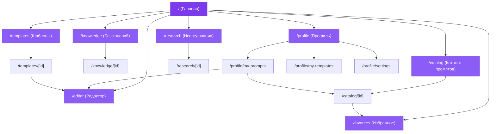
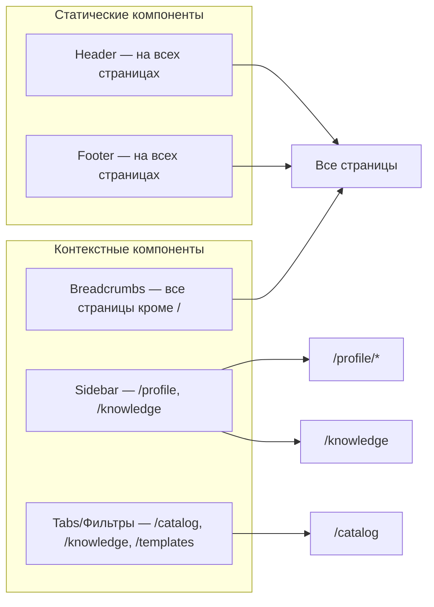

# PromptHub — Информационная архитектура и навигация

**PromptHub** — онлайн-сервис для управления промптами для языковых моделей. Пользователи могут создавать, редактировать, хранить и использовать промпты, изучать техники промпт-инжиниринга, пользоваться готовыми шаблонами и исследовать достижения в области языковых моделей.

---

## Задание 1. Информационная архитектура (дерево страниц)

### Дерево страниц

```
/ (Главная)
├── /catalog (Каталог промптов)
│   └── /catalog/[id] (Детали промпта)
├── /editor (Редактор промптов)
├── /knowledge (База знаний)
│   └── /knowledge/[id] (Статья)
├── /templates (Шаблоны)
│   └── /templates/[id] (Детали шаблона)
├── /research (Исследования)
│   └── /research/[id] (Детали исследования)
├── /favorites (Избранное)
└── /profile (Личный кабинет)
    ├── /profile/my-prompts (Мои промпты)
    ├── /profile/my-templates (Мои шаблоны)
    └── /profile/settings (Настройки)
```

### Описание страниц

#### 1. Главная (/)

| Параметр | Описание |
|---|---|
| **Цель страницы** | Привлечь пользователя, показать возможности сервиса |
| **Основные типы контента** | Герой-секция с описанием сервиса, карточки функций, популярные промпты, CTA-кнопки |
| **Точки входа** | Первый визит на сайт, логотип в хедере |
| **Точки выхода** | /catalog, /editor, /knowledge |

#### 2. Каталог промптов (/catalog)

| Параметр | Описание |
|---|---|
| **Цель страницы** | Позволить найти нужный промпт |
| **Основные типы контента** | Поисковая строка, фильтры по категориям, сортировка, карточки промптов |
| **Точки входа** | Навигация в хедере, герой-секция, поисковая строка |
| **Точки выхода** | /catalog/[id], /favorites, любая другая страница через хедер |

#### 3. Детали промпта (/catalog/[id])

| Параметр | Описание |
|---|---|
| **Цель страницы** | Показать полную информацию о промпте |
| **Основные типы контента** | Полный текст промпта, информация об авторе, рейтинг, теги, похожие промпты |
| **Точки входа** | Карточка в каталоге |
| **Точки выхода** | /catalog, /favorites, /editor |

#### 4. Редактор промптов (/editor)

| Параметр | Описание |
|---|---|
| **Цель страницы** | Создавать и редактировать промпты |
| **Основные типы контента** | Текстовый редактор, превью результата, панель инструментов |
| **Точки входа** | Навигация в хедере, кнопка «Новый промпт» из профиля |
| **Точки выхода** | /catalog, /profile/my-prompts |

#### 5. База знаний (/knowledge)

| Параметр | Описание |
|---|---|
| **Цель страницы** | Обучить пользователя техникам промпт-инжиниринга |
| **Основные типы контента** | Статьи, фильтры по категориям, поиск |
| **Точки входа** | Навигация в хедере |
| **Точки выхода** | /knowledge/[id], любая другая страница через хедер |

#### 6. Статья (/knowledge/[id])

| Параметр | Описание |
|---|---|
| **Цель страницы** | Предоставить подробную информацию по теме промпт-инжиниринга |
| **Основные типы контента** | Полный текст статьи, время чтения, категория, информация об авторе |
| **Точки входа** | Карточка в базе знаний |
| **Точки выхода** | /knowledge |

#### 7. Шаблоны (/templates)

| Параметр | Описание |
|---|---|
| **Цель страницы** | Предоставить готовые шаблоны для промптов |
| **Основные типы контента** | Карточки шаблонов, фильтры по категориям, поиск |
| **Точки входа** | Навигация в хедере |
| **Точки выхода** | /templates/[id], /editor |

#### 8. Детали шаблона (/templates/[id])

| Параметр | Описание |
|---|---|
| **Цель страницы** | Показать шаблон и дать возможность его использовать |
| **Основные типы контента** | Описание шаблона, категория, теги, текст шаблона |
| **Точки входа** | Карточка в каталоге шаблонов |
| **Точки выхода** | /templates, /editor |

#### 9. Исследования (/research)

| Параметр | Описание |
|---|---|
| **Цель страницы** | Показать исследования в области языковых моделей |
| **Основные типы контента** | Карточки исследований, авторы, даты публикации |
| **Точки входа** | Навигация в хедере |
| **Точки выхода** | /research/[id] |

#### 10. Детали исследования (/research/[id])

| Параметр | Описание |
|---|---|
| **Цель страницы** | Предоставить полную информацию об исследовании |
| **Основные типы контента** | Название, авторы, дата, описание, основные выводы |
| **Точки входа** | Карточка в списке исследований |
| **Точки выхода** | /research |

#### 11. Избранное (/favorites)

| Параметр | Описание |
|---|---|
| **Цель страницы** | Показать сохранённые пользователем промпты |
| **Основные типы контента** | Карточки избранных промптов |
| **Точки входа** | Хедер (иконка сердца), кнопка «Добавить в избранное» на карточках промптов |
| **Точки выхода** | /catalog, /catalog/[id] |

#### 12. Личный кабинет (/profile)

| Параметр | Описание |
|---|---|
| **Цель страницы** | Управлять аккаунтом и личным контентом |
| **Основные типы контента** | Информация о пользователе, статистика, быстрые ссылки |
| **Точки входа** | Хедер (иконка профиля) |
| **Точки выхода** | /profile/my-prompts, /profile/my-templates, /profile/settings |

#### 13. Мои промпты (/profile/my-prompts)

| Параметр | Описание |
|---|---|
| **Цель страницы** | Показать промпты, созданные пользователем |
| **Основные типы контента** | Карточки промптов, кнопка создания нового промпта |
| **Точки входа** | /profile, навигация в хедере |
| **Точки выхода** | /editor, /catalog/[id] |

#### 14. Мои шаблоны (/profile/my-templates)

| Параметр | Описание |
|---|---|
| **Цель страницы** | Показать шаблоны, созданные пользователем |
| **Основные типы контента** | Список шаблонов пользователя |
| **Точки входа** | /profile |
| **Точки выхода** | /templates/[id], /editor |

#### 15. Настройки (/profile/settings)

| Параметр | Описание |
|---|---|
| **Цель страницы** | Управление настройками аккаунта |
| **Основные типы контента** | Форма профиля, настройки уведомлений, выбор темы оформления |
| **Точки входа** | /profile |
| **Точки выхода** | /profile |

---

## Задание 2. Навигация

### Компонентная структура навигации

#### Header (Статический)

Статический компонент, присутствует на всех страницах сервиса.

- **Логотип** «PromptHub» — кликабельный, ведёт на /
- **Основная навигация**: Каталог, Редактор, База знаний, Шаблоны, Исследования
- **Поисковая строка** (визуальная) — открывает расширенный поиск по всему контенту
- **Иконки**: Избранное (/favorites), Профиль (/profile)
- **Мобильное меню** (гамбургер) — адаптивная версия навигации для мобильных устройств

#### Sidebar (Контекстный — динамический)

Контекстный компонент, появляется на определённых страницах с подразделами.

- **На странице /profile**: Мои промпты, Мои шаблоны, Настройки
- **На странице /knowledge**: категории статей базы знаний
- **Подсвечивает** текущий активный раздел
- При отсутствии подразделов на странице — не отображается

#### Breadcrumbs (Динамические)

Динамический компонент, генерируются автоматически из URL.

- **Формат**: Главная > Раздел > Подраздел
- **Последний элемент** — не кликабельный (текущая страница)
- **Пример**: Главная > Каталог промптов > Просмотр
- **Отображается** на всех страницах, кроме главной (/)

#### Footer (Статический)

Статический компонент, присутствует на всех страницах.

- **Три колонки**: Бренд (логотип и описание), Навигация (ссылки на разделы), Информация (условия использования, политика конфиденциальности, контакты)
- Содержит дополнительные ссылки для навигации и информации о сервисе

#### Tabs (Контекстный)

Контекстный компонент — категории-фильтры на страницах каталогов.

- **На /catalog**: фильтры по категориям промптов (Маркетинг, Программирование, Образование и т.д.)
- **На /knowledge**: фильтры по категориям статей (Базовые техники, Продвинутые техники, Лучшие практики)
- **На /templates**: фильтры по категориям шаблонов

### Маппинг навигационных компонентов

| Компонент | Главная | Каталог | Редактор | База знаний | Шаблоны | Исследования | Избранное | Профиль |
|---|:---:|:---:|:---:|:---:|:---:|:---:|:---:|:---:|
| Header | ✓ | ✓ | ✓ | ✓ | ✓ | ✓ | ✓ | ✓ |
| Sidebar | — | — | — | ✓ | — | — | — | ✓ |
| Breadcrumbs | — | ✓ | ✓ | ✓ | ✓ | ✓ | ✓ | ✓ |
| Footer | ✓ | ✓ | ✓ | ✓ | ✓ | ✓ | ✓ | ✓ |
| Tabs | — | ✓ | — | ✓ | ✓ | — | — | — |

---

## Задание 3. UX-проверка

### Пользовательские сценарии

#### Сценарий 1: Новый пользователь ищет промпт и добавляет его в избранное

1. Пользователь попадает на главную страницу (/)
2. Видит герой-секцию с описанием сервиса и карточки функций
3. Нажимает «Каталог промптов» или переходит через навигацию в хедере
4. На странице каталога (/catalog) вводит запрос в поисковую строку
5. Фильтрует результаты по категории (например, «Маркетинг»)
6. Находит интересующий промпт и переходит на страницу деталей (/catalog/[id])
7. Читает описание и содержимое промпта
8. Нажимает кнопку «Добавить в избранное»
9. Переходит в избранное (/favorites) через хедер и видит сохранённый промпт

#### Сценарий 2: Пользователь создаёт новый промпт через редактор

1. Пользователь авторизован, находится на главной странице
2. Переходит в Редактор через навигацию в хедере (/editor)
3. Вводит название промпта в поле заголовка
4. Пишет текст промпта в левой панели редактора
5. Видит превью результата в правой панели
6. Использует кнопку «Форматировать» для структурирования текста
7. Нажимает «Сохранить»
8. Промпт сохраняется, пользователь может найти его в «Мои промпты» (/profile/my-prompts)

#### Сценарий 3: Пользователь изучает базу знаний

1. Через хедер переходит в раздел «База знаний» (/knowledge)
2. Фильтрует статьи по категории «Продвинутые техники»
3. Выбирает интересующую статью и читает её (/knowledge/[id])
4. Возвращается к списку через кнопку «Назад к базе знаний»
5. Переходит в каталог шаблонов (/templates) для применения полученных знаний на практике

### Проверка на «мёртвые концы»

Проверка выполнена для каждого маршрута. Мёртвые концы отсутствуют:

- **Header** присутствует на всех страницах и обеспечивает доступ ко всем основным разделам
- **Каждая страница деталей** содержит ссылку «Назад» или хлебные крошки для возврата
- **Footer** присутствует на всех страницах и предоставляет дополнительные ссылки
- **Состояния пустых списков** (например, пустое избранное) содержат ссылки на релевантные страницы (каталог промптов)
- **Все страницы доступны** через основную навигацию в хедере

### Рекомендации по улучшению навигации

1. **Глобальная поисковая строка** — добавить автодополнение и мгновенный поиск по промптам, статьям и шаблонам прямо из хедера
2. **Хлебные крошки на главной** — рассмотреть добавление для полноты, несмотря на то что главная является корнем навигации
3. **Бесконечная прокрутка** — реализовать в каталогах при большом количестве элементов вместо постраничной навигации
4. **Страница «О сервисе»** — добавить в footer для предоставления информации о миссии и возможностях PromptHub
5. **Система уведомлений** — реализовать иконку уведомлений в хедере для оповещения о новых ответах, комментариях и обновлениях

---

## Дополнительное задание

### sitemap.xml

Автоматическая генерация sitemap.xml через Next.js (app/sitemap.ts):

- Все статические маршруты (/catalog, /editor, /knowledge, /templates, /research, /favorites, /profile)
- Динамические маршруты, генерируемые из данных (конкретные id промптов, статей, шаблонов, исследований)
- Автоматическое обновление при изменении контента

### robots.txt

Файл public/robots.txt:

- Разрешить индексацию всех публичных страниц
- Запретить индексацию /profile и всех подмаршрутов (/profile/*), так как это персональные данные пользователя

### Mermaid-диаграмма навигации



### Маппинг навигационных компонентов (диаграмма)


